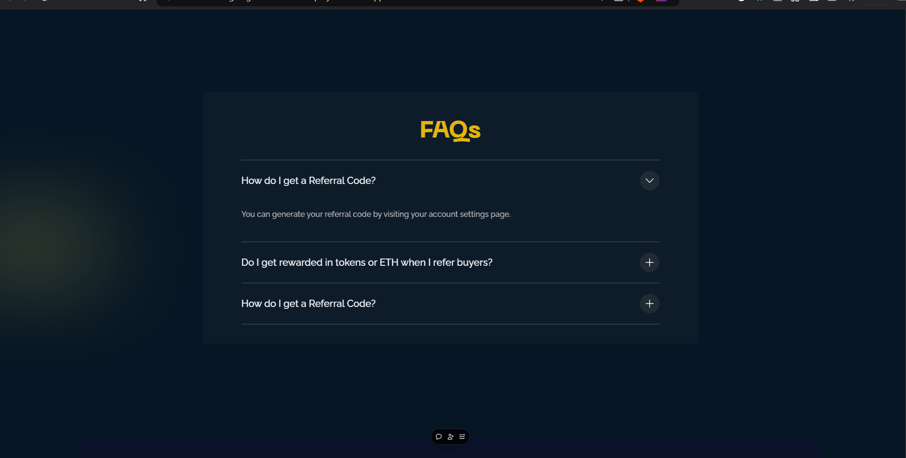

# Moonex Landing Page 🌙🚀

Welcome to **Moonex**, a modern, sleek, and fully responsive landing page built with **React** and styled using **Tailwind CSS**. This project is designed to showcase best practices, including a custom-tailored color palette, reusable components, and a partial implementation of the **Atomic Design Principle** for maintainable and scalable code.

---

## Features ✨

### 🔹 Fully Responsive Design  
Moonex adapts seamlessly to all screen sizes, from desktops to tablets and mobile devices, providing an excellent user experience across devices.

### 🔹 Sleek and Modern UI  
Designed with a clean and intuitive interface, Moonex focuses on aesthetics and usability, ensuring visitors are captivated from the moment they arrive.

### 🔹 Tailored Color Palette  
The Tailwind CSS configuration is enhanced with a **custom color palette**, ensuring brand consistency and unique styling throughout the app.

### 🔹 Reusable Components  
Most of the UI element is developed as a **reusable component**, making the design flexible, consistent, and easier to maintain or scale.

### 🔹 Atomic Design Principles (Partially Implemented)  
The project follows a modular approach inspired by Atomic Design. While fully implementing the methodology is a work in progress, the current structure includes:  
- **Atoms**: Basic building blocks like buttons, input fields, etc.  
- **Molecules**: Components like card layouts combining multiple atoms.  
- **Organisms**: Larger structures such as navigation bars or hero sections.

---

## Technologies Used 🛠️

- **React**: To create a dynamic and interactive user interface.  
- **Tailwind CSS**: For effortless styling with utility-first classes.  
- **Custom Tailwind Config**: To define unique colors, spacing, and typography.  
- **Atomic Design**: To ensure a structured and reusable component hierarchy.

---

## Live Link 📎
- https://moonex-nnixgkcvg-shubha-sarkars-projects.vercel.app/

---

## Screenshots 🖼️

### Desktop

### Mobile (Very Small Screen)

